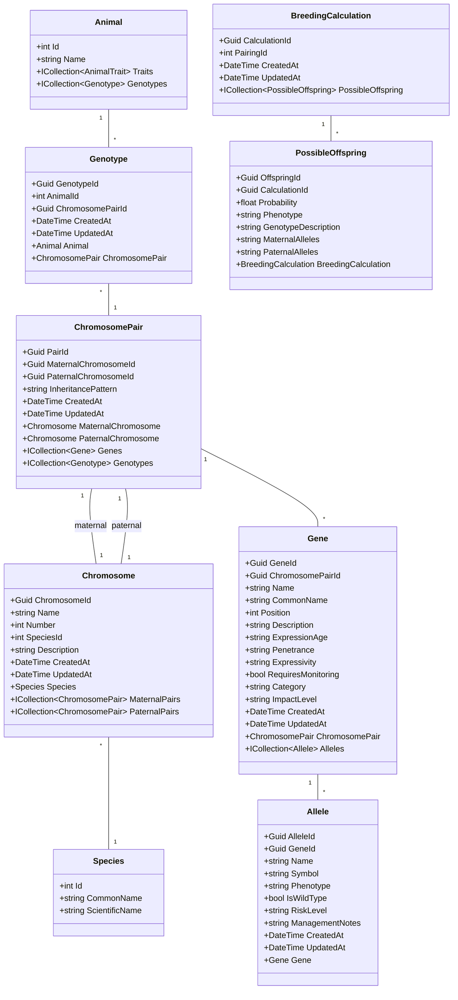

# Genetics Models and Relationships

This diagram shows how the genetics-related models work together in the R.A.T. App.

## Key Components

1. Core Genetic Structure:
   - Species defines the base genetic structure
   - Chromosomes belong to specific species
   - ChromosomePairs link maternal and paternal chromosomes
   - Genes are positioned on chromosome pairs
   - Alleles represent variants of genes

2. Animal Genetics:
   - Animals have Genotypes
   - Genotypes link to ChromosomePairs
   - This tracks both maternal and paternal genetic information

3. Breeding Calculations:
   - BreedingCalculation tracks potential offspring outcomes
   - PossibleOffspring stores predicted genetic combinations
   - Includes probability and phenotype predictions

4. Genetic Properties:
   - Genes track expression age, penetrance, and impact
   - Alleles define specific variants with phenotypes
   - Risk levels and management notes for genetic traits

5. Temporal Tracking:
   - CreatedAt/UpdatedAt timestamps on genetic records
   - Helps track genetic data evolution over time
