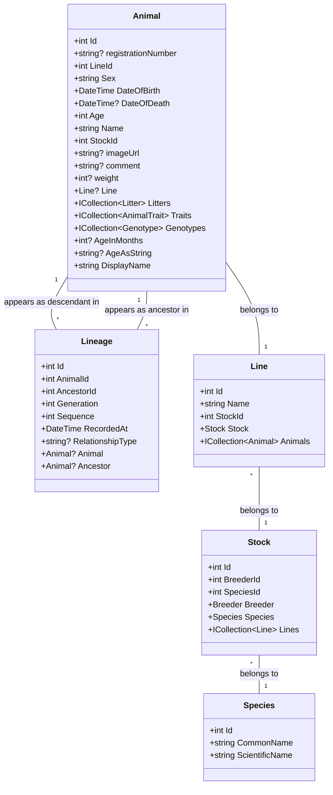

# Lineage and Line Ancestry Relationships

This diagram shows how Animal and Lineage work together to track ancestry relationships in the R.A.T. App.

## Key Components

1. Animal-Lineage Relationships:
   - Each Animal can appear in multiple Lineage records as either:
     * A descendant (via AnimalId)
     * An ancestor (via AncestorId)
   - Lineage records store:
     * Generation number (1 for parents, 2 for grandparents, etc.)
     * Sequence number (1=dam side, 2=sire side)
     * RelationshipType ("Maternal" or "Paternal")
     * Timestamp of when the relationship was recorded

2. Animal-Line-Stock Hierarchy:
   - Animals belong to Lines
   - Lines belong to Stocks
   - Stocks belong to Species
   - This hierarchy helps organize breeding programs and track varieties

3. Navigation Properties:
   - Lineage.Animal: The descendant animal in the relationship
   - Lineage.Ancestor: The ancestor animal in the relationship
   - Animal.Line: The line this animal belongs to
   - Line.Stock: The stock this line belongs to
   - Stock.Species: The species this stock represents
