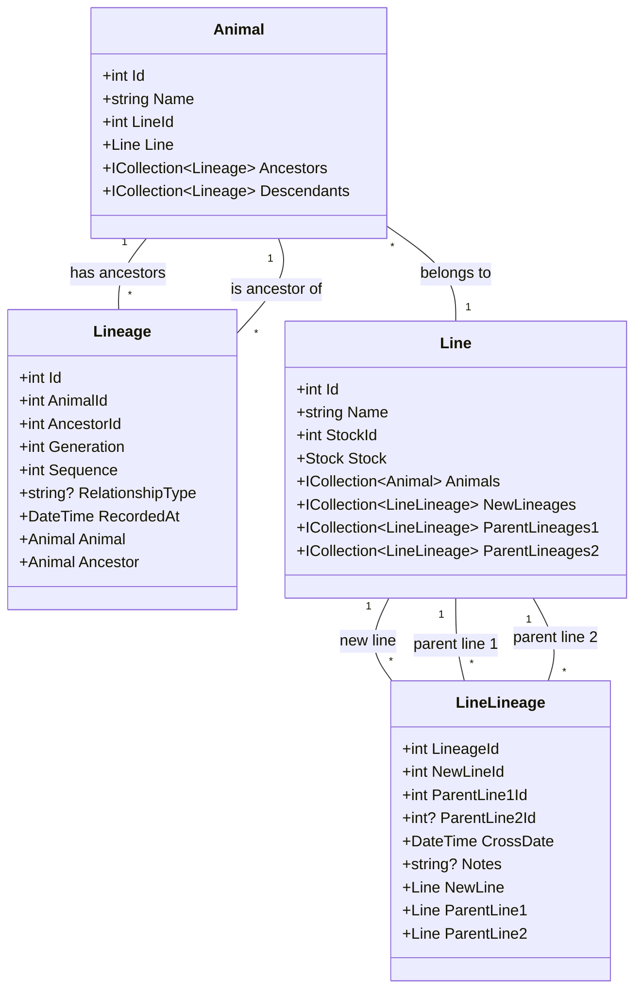

# Lineage and Line Ancestry Relationships

This diagram shows how Animal, Lineage, and LineLineage work together to track both individual animal ancestry and line ancestry in the R.A.T. App.

## Key Components

1. Individual Animal Ancestry (Animal-Lineage):
- Each Animal can have multiple Lineage records as both a descendant and ancestor
- Lineage tracks generation and sequence numbers for precise relationship mapping
- RelationshipType distinguishes between maternal and paternal lines

2. Line Ancestry (Line-LineLineage):
- Lines can be created from crossing other lines
- LineLineage tracks the creation of new lines from parent lines
- Supports both single-parent and two-parent line creation
- Records the date of line creation and optional notes

The connection between these systems:
- Animals belong to Lines
- When new lines are created through breeding, the LineLineage system tracks the line relationships
- Individual animal ancestry is tracked separately through the Lineage system
- This allows tracking both individual animal pedigrees and the broader line development history
